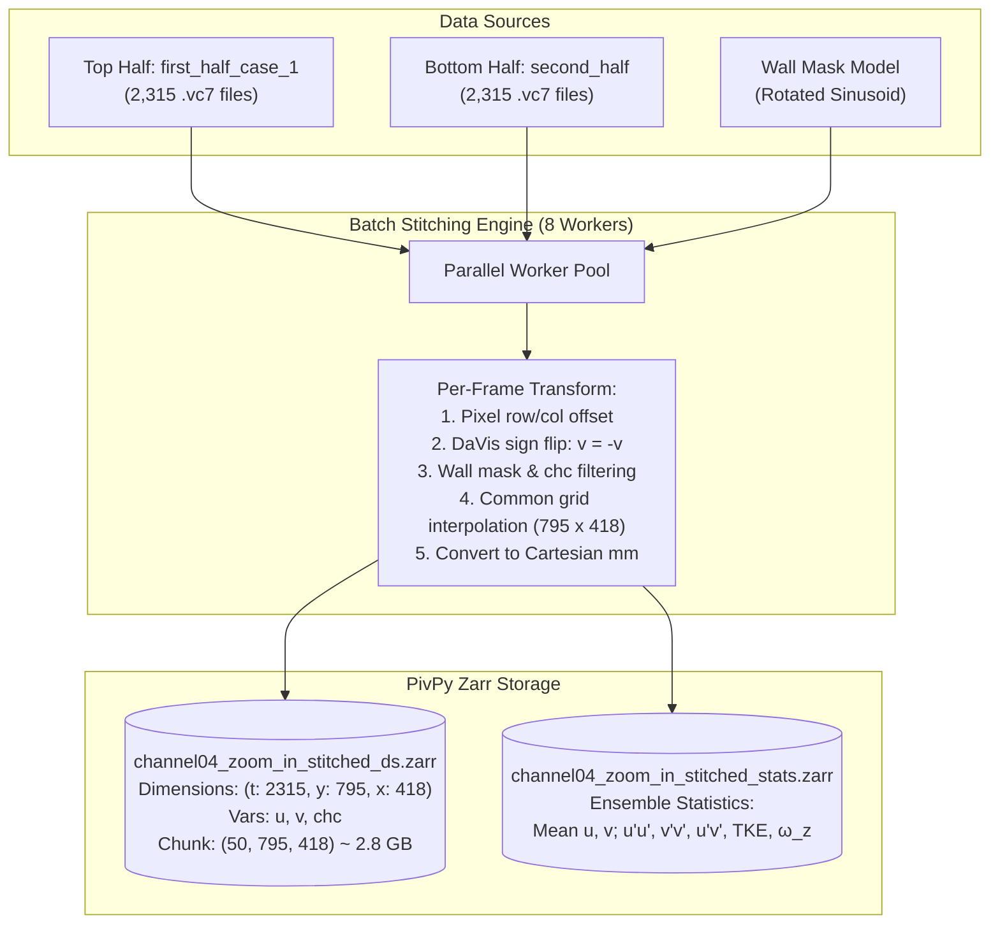
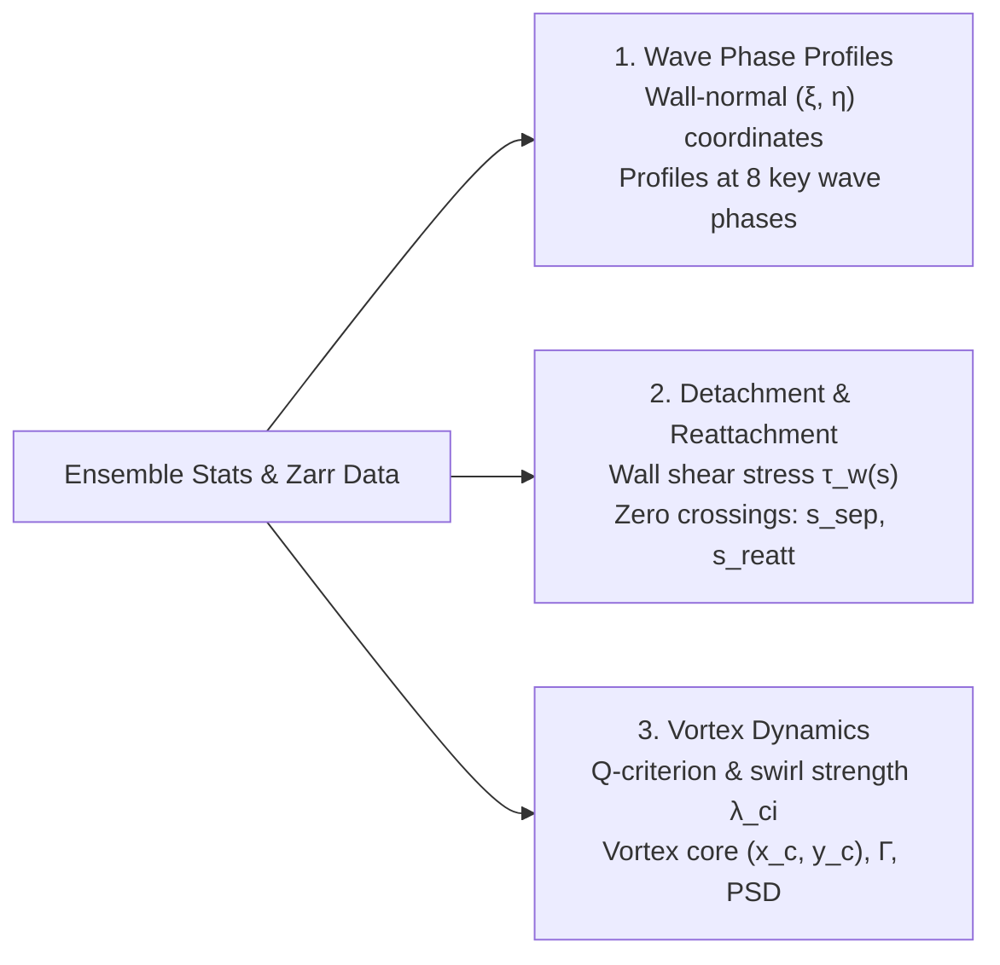

# Wavy Channel Zoom-In Full Dataset Analysis & Post-Processing Plan

This document outlines the end-to-end plan for stitching the complete 2,315-frame dual-half dataset of the sinusoidal channel near-wall zoom-in, generating consolidated PivPy Zarr datasets, and executing advanced hydrodynamic post-processing.

**Date**: 2026-09-27  
**Status**: Planned (Ready for execution)  
**Reference Prototype**: [`notebooks/channel04_zoom_in_stitched_vectors.py`](file:///C:/Users/alex/Github/piv_channel/notebooks/channel04_zoom_in_stitched_vectors.py)  
**Wall Mask Reference**: [`notebooks/channel04_zoom_in_second_half_wall_mask.json`](file:///C:/Users/alex/Github/piv_channel/notebooks/channel04_zoom_in_second_half_wall_mask.json)

---

## 1. Executive Summary & Goals

The sinusoidal channel zoom-in dataset captures high-resolution flow fields along the wavy wall boundary layer, crest, trough, and recirculation zone. Previously, only Frame 1 (`B00001.vc7`) was stitched for visualization. 

This project expands the analysis to the **full temporal recording** ($N = 2,315$ frames @ 15 Hz, duration $T \approx 154.3\text{ s}$), creates high-performance chunked Zarr stores, and executes comprehensive post-processing:
1. **Wall-normal profiles at discrete wave phases** ($\phi = 0, \pi/4, \pi/2, 3\pi/4, \pi, \dots$).
2. **Wall shear stress ($\tau_w$) estimation** and exact identification of **detachment ($s_{\text{sep}}$)** and **reattachment ($s_{\text{reatt}}$)** points.
3. **Vortex identification & tracking** (location, circulation $\Gamma$, swirl strength $\lambda_{ci}$, $Q$-criterion, and vortex core trajectory/shedding frequency).

---

## 2. Dataset Specifications & Calibration

### Input Directories
- **Top Half (`first_half_case_1`)**:
  - Path: `D:\channel_flow_research\channel_04_zoom_in\Project_FlowMaster_260705_110445\first_half_case_1\ImgPreproc_03\PIV_MPd(4x24x24_75%ov_ImgCorr)`
  - Total Files: 2,315 `.vc7` files (`B00001.vc7` to `B02315.vc7`)
- **Bottom Half (`second_half`)**:
  - Path: `D:\channel_flow_research\channel_04_zoom_in\Project_FlowMaster_260705_110445\second_half\ImgPreproc\PIV_MPd(4x24x24_75%ov_ImgCorr)`
  - Total Files: 3,000 `.vc7` files (`B00001.vc7` to `B03000.vc7`)
- **Coincident Frame Count**: $\min(2315, 3000) = 2,315$ pairs.
- **Acquisition Frequency**: $f_s = 15.0\text{ Hz}$ ($\Delta t_{\text{frame}} = 66.67\text{ ms}$).

### Coordinate Alignment & Stitching Parameters
- `PX_PER_MM = 995.28671814631889`
- Pixel row height per frame: `RAW_H = 2390` (row offset for bottom half)
- Pixel column offset: `RAW_C = 80` (column offset for bottom half)
- Velocity sign correction: $v_{\text{physical}} = -v_{\text{DaVis}}$
- Rotated-sinusoidal wall model (from `channel04_zoom_in_second_half_wall_mask.json`):
  $$x_{\text{wall}}(y_{\text{px}}) = x_{\text{center}} + \text{drift} \cdot y_{\text{px}} + A \cdot \sin\left(\frac{2\pi y_{\text{px}}}{\lambda_{\text{px}}} + \phi_0\right)$$
  - Wavelength: $\lambda_{\text{px}} = 4862.16\text{ px}$ ($\lambda \approx 4.885\text{ mm}$)
  - Amplitude: $A = 555.24\text{ px}$ ($A \approx 0.558\text{ mm}$)
  - Phase: $\phi_0 = 4.74668\text{ rad}$
  - Drift: $\text{drift} = 0.03800\text{ px/row}$
  - Center: $x_{\text{center}} = 1310.69\text{ px}$
- Grid Resolution: $795 \times 418$ points (spatial resolution $\Delta x \approx \Delta y \approx 6.0\,\mu\text{m}$).
- Seam handling: Linear interpolation bridging the 14 px interrogation margin.

---

## 3. Data Pipeline & Zarr Storage Architecture

### Zarr Schema Details
1. **Time-Series Store**: `outputs/channel04_zoom_in_stitched_ds.zarr`
   - Coordinates:
     - `t`: Frame index ($0 \dots 2314$)
     - `time_s`: Timestamp ($0.0 \dots 154.27\text{ s}$)
     - `y`: Streamwise coordinate ($-4.805 \dots -0.018\text{ mm}$, increasing upward)
     - `x`: Wall-normal / cross-channel coordinate ($0.0 \dots 2.514\text{ mm}$)
   - Data variables:
     - `u(t, y, x)`: Streamwise velocity [m/s]
     - `v(t, y, x)`: Transverse velocity [m/s]
     - `chc(t, y, x)`: Vector validity flag ($1 = \text{valid}, 0 = \text{masked/invalid}$)
   - Storage format: Blosc/zstandard compressed, chunk size `(50, 795, 418)`.
2. **Ensemble Statistics Store**: `outputs/channel04_zoom_in_stitched_stats.zarr`
   - `u_mean(y, x)`, `v_mean(y, x)`: Time-averaged velocity fields
   - `u_fluc(t, y, x) = u - u_mean`, `v_fluc(t, y, x) = v - v_mean`
   - `uu(y, x) = <u'u'>`, `vv(y, x) = <v'v'>`, `uv(y, x) = <u'v'>`
   - `tke(y, x) = 0.5 * (uu + vv)`
   - `vorticity(y, x) = ∂v_mean/∂x - ∂u_mean/∂y`

---

## 4. Post-Processing Workflows & Scientific Methods

### 4.1 Wall-Normal Velocity Profiles along Wave Phases
- **Curvilinear Surface Formulation**:
  For wall profile $x_w(y)$, define arc-length coordinate $s(y)$ and local wall tangent/normal:
  $$\mathbf{t}(y) = \frac{1}{\sqrt{1 + (x_w')^2}} \begin{pmatrix} x_w' \\ 1 \end{pmatrix}, \quad \mathbf{n}(y) = \frac{1}{\sqrt{1 + (x_w')^2}} \begin{pmatrix} -1 \\ x_w' \end{pmatrix}$$
- **Wave Phases ($\phi$)**:
  - $\phi = 0$: Wave Crest (minimum cross-section, flow acceleration)
  - $\phi = \pi/4$: Favorable-to-adverse transition
  - $\phi = \pi/2$: Adverse pressure gradient / separation onset
  - $\phi = 3\pi/4$: Main recirculation region
  - $\phi = \pi$: Wave Trough (maximum cross-section, vortex core)
  - $\phi = 5\pi/4$: Reattachment boundary
  - $\phi = 3\pi/2$: Favorable pressure gradient recovery
  - $\phi = 7\pi/4$: Approach to next crest
- **Quantities to Extract**:
  - Tangential profile $u_\parallel(\eta) = \mathbf{u} \cdot \mathbf{t}$ vs. wall distance $\eta$
  - Wall-normal velocity $u_\perp(\eta) = \mathbf{u} \cdot \mathbf{n}$ vs. $\eta$
  - Reynolds shear stress $\langle u'_\parallel u'_\perp \rangle(\eta)$

### 4.2 Detachment & Reattachment Points via Wall Shear Stress ($\tau_w$)
- **Wall Shear Stress Estimation**:
  $$\tau_w(s) \approx \mu \left. \frac{\partial u_\parallel}{\partial \eta} \right|_{\eta \to 0}$$
  Linear/polynomial regression over the first 3–5 grid points normal to the wall ($\eta < 50\,\mu\text{m}$).
- **Key Diagnostic Locations**:
  - **Detachment / Separation Point ($s_{\text{sep}}$)**: $\tau_w(s) = 0$ with $\frac{d\tau_w}{ds} < 0$.
  - **Reattachment Point ($s_{\text{reatt}}$)**: $\tau_w(s) = 0$ with $\frac{d\tau_w}{ds} > 0$.
  - **Separation Bubble Length**: $L_{\text{sep}} = s_{\text{reatt}} - s_{\text{sep}}$ (and normalized $L_{\text{sep}}/\lambda$).
  - **Reversed Flow Fraction**: Percentage of time instantaneous near-wall flow is reversed ($u_\parallel < 0$).

### 4.3 Vortex Characterization & Dynamics
- **Identification Criteria**:
  - Vorticity: $\omega_z = \frac{\partial v}{\partial x} - \frac{\partial u}{\partial y}$
  - Hunt's $Q$-criterion: $Q = \frac{1}{2}\left(\|\mathbf{\Omega}\|^2 - \|\mathbf{S}\|^2\right) > 0$
  - Swirl Strength: $\lambda_{ci}$ (imaginary part of complex eigenvalues of $\nabla \mathbf{u}$)
  - Graftieaux criteria: $\Gamma_1$ (vortex center) and $\Gamma_2$ (vortex boundary)
- **Vortex Metrics**:
  - Mean vortex core center: $(x_c, y_c)$ in physical and wave-phase coordinates
  - Circulation: $\Gamma = \iint_{Q > 0} \omega_z \, dA$
  - Instantaneous core trajectory over time $(x_c(t), y_c(t))$ to capture vortex flapping / breathing
  - Power Spectral Density (PSD) via Welch's method to detect the dominant shedding frequency and Strouhal number:
    $$St = \frac{f \cdot 2A}{U_{\text{bulk}}}$$

---

## 5. Implementation Roadmap & Task List

- [ ] **Task 1: Batch Stitching Engine** (`notebooks/channel04_zoom_in_batch_stitch.py`)
  - [ ] Implement multi-process worker pool (`concurrent.futures.ProcessPoolExecutor`)
  - [ ] Stream through all 2,315 `.vc7` pairs
  - [ ] Write directly into chunked `outputs/channel04_zoom_in_stitched_ds.zarr`
  - [ ] Compute and save `outputs/channel04_zoom_in_stitched_stats.zarr`
- [ ] **Task 2: Wall-Normal Curvilinear Profiling Module**
  - [ ] Analytical/spline projection of grid points onto local wall normal $\eta$
  - [ ] Extraction of $u_\parallel(\eta)$, $u_\perp(\eta)$, and $\langle u'_\parallel u'_\perp \rangle$ at 8 phase stations
  - [ ] Validation against boundary layer self-similarity / log-law
- [ ] **Task 3: Wall Shear Stress & Separation Detection Module**
  - [ ] Near-wall gradient evaluation along the full arc length $s \in [0, \lambda]$
  - [ ] Automated zero-crossing finder for separation and reattachment
  - [ ] Computation of reversed flow fraction map
- [ ] **Task 4: Vortex Dynamics & Spectral Tracking Module**
  - [ ] Computation of $\omega_z$, $Q$-criterion, and $\lambda_{ci}$
  - [ ] Core center tracking algorithm and circulation integration
  - [ ] FFT / Welch spectrum of vortex core displacement and near-wall velocity
- [ ] **Task 5: Interactive Marimo Notebook** (`notebooks/channel04_zoom_in_wavy_postproc.py`)
  - [ ] Phase slider for interactive wall-normal profile inspection
  - [ ] Streamline & quiver overlay on mean and instantaneous scalar fields
  - [ ] Detachment/reattachment interactive markers
  - [ ] Vortex tracking dashboard with frequency spectra
